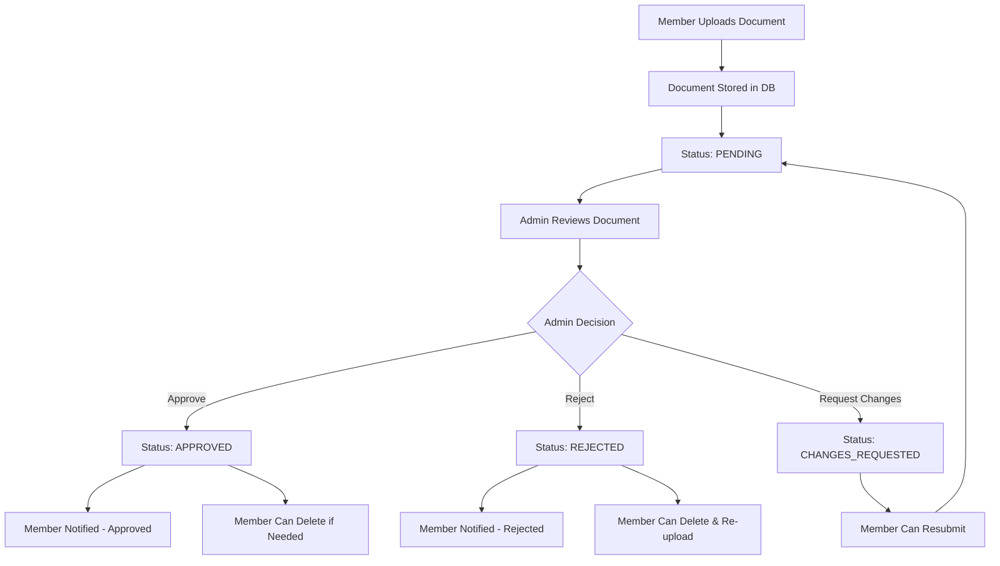

# 📋 Document Verification Flow - Complete Guide

## 🔄 **Complete Document Lifecycle**



---

## 1. **Member Document Upload**

### **📤 Upload Process**
- **Endpoint:** `POST /api/proxy/member-auth/me/documents/`
- **Storage:** Files stored in `backend/private_media/member_documents/`
- **Database:** `member_documents` table

### **📊 Document Model Structure**
```python
class MemberDocument:
    id: UUID                    # Primary key
    member: ForeignKey          # Owner of document
    document_type: CharField    # "Government ID", "Aadhaar", etc.
    
    # File Storage (Hybrid approach)
    file_data: BinaryField      # File content in DB (new)
    file_path: FileField        # File path on disk (legacy)
    file_name: CharField        # Original filename
    file_content_type: CharField # MIME type
    file_size: IntegerField     # Size in bytes
    
    # Status & Review
    status: CharField           # PENDING/APPROVED/REJECTED/EXPIRED
    rejection_reason: TextField
    changes_requested_reason: TextField
    
    # Audit Trail
    uploaded_at: DateTime
    reviewed_at: DateTime
    reviewed_by_id: UUID        # Admin/SuperAdmin who reviewed
    
    # Soft Deletion
    is_deleted: Boolean
    deleted_at: DateTime
    deleted_by_id: UUID
    deletion_reason: TextField
```

---

## 2. **Admin Review Dashboard**

### **📋 Admin Document List**
- **Endpoint:** `GET /api/proxy/admin/documents/`
- **Filters:** Status, Document Type, Member ID, Search
- **Pagination:** 25 items per page
- **Permissions:** `documents.view`

### **🔍 Admin Document Detail**
- **Endpoint:** `GET /api/proxy/admin/documents/{id}/`
- **Shows:** Full document info + review history
- **Download:** `GET /api/proxy/admin/documents/{id}/download/`

---

## 3. **Admin Actions**

### **✅ Approve Document**
- **Endpoint:** `POST /api/proxy/admin/documents/{id}/approve/`
- **Permission:** `documents.approve`
- **Result:** Status → APPROVED
- **Notifications:** Member notified via email/SMS
- **Events:** Real-time WebSocket events

### **❌ Reject Document**
- **Endpoint:** `POST /api/proxy/admin/documents/{id}/reject/`
- **Permission:** `documents.reject`
- **Required:** Rejection reason (min 10 chars)
- **Result:** Status → REJECTED
- **Notifications:** Member notified with reason

### **🔄 Request Changes**
- **Endpoint:** `POST /api/proxy/admin/documents/{id}/request-changes/`
- **Permission:** `documents.reject`
- **Required:** Specific changes needed
- **Result:** Status → CHANGES_REQUESTED
- **Member Action:** Can resubmit same document

### **🗑️ Soft Delete**
- **Endpoint:** `POST /api/proxy/admin/documents/{id}/delete/`
- **Permission:** `documents.delete`
- **Result:** `is_deleted=True`, document hidden from lists

---

## 4. **Member Document Management**

### **📁 List Own Documents**
- **Endpoint:** `GET /api/proxy/member-auth/me/documents/`
- **Shows:** All uploaded documents + status

### **🗑️ Delete Own Document** ⚠️ **(Currently Broken - 500 Error)**
- **Endpoint:** `DELETE /api/proxy/member-auth/me/documents/{id}/`
- **Rules:** 
  - Can delete PENDING or REJECTED documents freely
  - APPROVED documents require deletion reason
  - Cannot delete if it's the only verification document

### **📥 Download Own Document**
- **Endpoint:** `GET /api/proxy/member-auth/verification/documents/{id}/download/`
- **Security:** Can only download own documents

---

## 5. **Audit & History**

### **📜 Review History**
```python
class DocumentReviewHistory:
    document: ForeignKey        # Which document
    member: ForeignKey          # Which member
    old_status: CharField       # Previous status
    new_status: CharField       # New status
    reason: TextField           # Why changed
    reviewer_notes: TextField   # Admin notes
    changed_by_id: UUID         # Who made change
    changed_by_role: CharField  # ADMIN/SUPER_ADMIN/STAFF
    ip_address: IPAddressField  # Security audit
    created_at: DateTime        # When changed
```

### **🔍 Audit Logs**
- All document actions logged to `admin_activity_log`
- Includes: WHO, WHAT, WHEN, WHY, IP address
- Used for compliance and security

---

## 6. **Notifications & Events**

### **📧 Member Notifications**
- **Approved:** "Your {document_type} has been approved"
- **Rejected:** "Your {document_type} was rejected: {reason}"
- **Changes Requested:** "Please update your {document_type}: {reason}"

### **🔴 Real-time Events** (WebSocket)
- `document_approved`: Live update to member dashboard
- `document_rejected`: Live update with reason
- `document_updated`: Admin sees live status changes

---

## 7. **File Storage Architecture**

### **🗃️ Storage Locations**
```
backend/
├── media/                     # Public files (old)
├── private_media/             # Protected files
│   ├── member_documents/      # ID documents
│   ├── support_attachments/   # Ticket files
│   └── profile_photos/        # Photos
└── database: file_data        # New: Files in DB as BYTEA
```

### **🔐 Security**
- **Private Storage:** No direct URL access
- **Authorization:** Must be authenticated + owner/admin
- **Download:** Goes through auth-protected endpoint
- **Audit:** All downloads logged

---

## 8. **Permission Matrix**

| Action | Super Admin | Admin | Staff | Member |
|--------|-------------|--------|--------|--------|
| View all documents | ✅ | ✅ *(with perm)* | ✅ *(with perm)* | ❌ |
| View own documents | N/A | N/A | N/A | ✅ |
| Approve documents | ✅ | ✅ *(documents.approve)* | ✅ *(documents.approve)* | ❌ |
| Reject documents | ✅ | ✅ *(documents.reject)* | ✅ *(documents.reject)* | ❌ |
| Delete documents (admin) | ✅ | ✅ *(documents.delete)* | ❌ | ❌ |
| Delete own documents | N/A | N/A | N/A | ✅ *(limited)* |
| Download any document | ✅ | ✅ *(documents.view)* | ✅ *(documents.view)* | ❌ |
| Download own documents | N/A | N/A | N/A | ✅ |

---

## 🚨 **Current Issue: 500 Error on Member Document Delete**

### **Error Location:**
`DELETE /api/proxy/member-auth/me/documents/{id}/`

### **Probable Causes:**
1. **Data validation error** in delete view
2. **Missing request.data** for approved document deletion reason
3. **Database constraint violation**
4. **Member verification status update error**

### **Debug Steps:**
1. Check if document exists and belongs to member
2. Verify document status (approved docs need reason)
3. Check member's remaining document count
4. Verify database constraints

---

## 📊 **Database Tables Involved**

1. **`member_documents`** - Main document storage
2. **`document_review_history`** - Audit trail of all changes
3. **`admin_activity_log`** - Admin action logging
4. **`member_login_activity`** - Security logging
5. **`notifications`** - Member notifications
6. **`profile_verification_requests`** - Queue system (if used)

---

## 🔧 **API Endpoints Summary**

### **Member Endpoints**
```
GET    /api/proxy/member-auth/me/documents/                     # List own
POST   /api/proxy/member-auth/me/documents/                     # Upload new
DELETE /api/proxy/member-auth/me/documents/{id}/                # Delete own ❌
GET    /api/proxy/member-auth/verification/documents/{id}/download/ # Download own
```

### **Admin Endpoints**
```
GET    /api/proxy/admin/documents/                              # List all
GET    /api/proxy/admin/documents/{id}/                         # View details
GET    /api/proxy/admin/documents/{id}/download/                # Download
POST   /api/proxy/admin/documents/{id}/approve/                 # Approve
POST   /api/proxy/admin/documents/{id}/reject/                  # Reject
POST   /api/proxy/admin/documents/{id}/request-changes/         # Request changes
POST   /api/proxy/admin/documents/{id}/delete/                  # Admin delete
```

---

## 🎯 **Next: Fix the DELETE Error**

The 500 error occurs in `MemberDocumentDeleteView`. Let me fix it now...