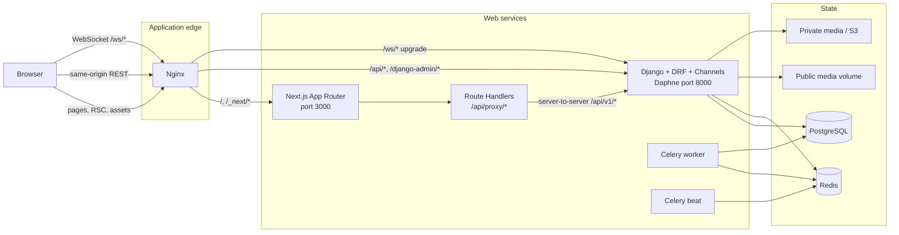

# Next.js application architecture

This document describes the migration target in `frontend-next/` and its integration with the existing Django system. The broader data model and domain workflows remain documented in [`../brain.md`](../brain.md).

## Runtime topology



Nginx exposes one public origin. Next.js owns the website and portal URL spaces. Django continues to own all business APIs, the Channels socket endpoint, and the built-in admin site. The built-in Django admin is deliberately mounted at `/django-admin/` so `/admin/*` can belong to the product portal.

## Next.js boundaries

The App Router uses route groups to give each audience a stable layout without adding group names to URLs:

| Route group or handler | Responsibility | Rendering/cache policy |
| --- | --- | --- |
| `(public)` | Navbar/footer and public marketing/content routes | Server-render public shells; only public content may be cached |
| `(auth)` and `(admin-auth)` | Member recovery and role-specific login screens | Auth responses are always `no-store` |
| `(member)` | Member navigation, session guard, private `noindex` metadata | Private data is client-fetched through the BFF and not cached |
| `(admin-portal)` | Admin and Super Admin shell plus dynamically loaded modules | Role and permission guarded; private and `noindex` |
| `(staff-portal)` | Staff shell and assigned work modules | Staff-only, private and `noindex` |
| `(support-portal)` | Customer Support shell and ticket modules | Support-only, private and `noindex` |
| `/api/proxy/[...path]` | Same-origin proxy to Django `/api/v1/*` | `no-store, private`; rejects foreign origins on mutations |
| `/api/auth/session` | Reports whether the browser has the two session cookies | Cookie-presence hint only; never substitutes for Django verification |

The root provider order is Redux, Theme, Auth, Framer Motion feature loading, and the React error boundary. Each browser gets its own Redux store. An auth transition aborts stale requests and clears RTK Query private cache.

## Route and role matrix

The request boundary provides an early redirect based on the `mdp_portal` cookie. Client layout guards then restore and verify the session. These checks improve navigation and avoid rendering the wrong portal, but Django remains the enforcement boundary.

| URL family | Anonymous | Member | Admin | Super Admin | Staff | Customer Support |
| --- | :---: | :---: | :---: | :---: | :---: | :---: |
| `/`, `/about`, `/contact`, `/success-stories`, `/membership` | Yes | Yes | Yes | Yes | Yes | Yes |
| `/blog`, `/blog/[slug]`, `/faq`, `/help`, `/privacy`, `/terms` | Yes | Yes | Yes | Yes | Yes | Yes |
| `/login`, `/register`, `/verify-otp`, recovery routes | Yes | Login flow | No portal access | No portal access | No portal access | No portal access |
| `/dashboard`, `/profile/*`, `/search`, `/matches` | Redirect | Yes | 403 | 403 | 403 | 403 |
| `/interests/*`, `/shortlist`, `/messages/*` | Redirect | Yes, subject to entitlements | 403 | 403 | 403 | 403 |
| `/membership/plans`, `/membership/status`, `/tickets/*` | Redirect | Yes | 403 | 403 | 403 | 403 |
| `/notifications`, `/settings` | Redirect | Yes | 403 | 403 | 403 | 403 |
| `/admin/*` | Redirect | 403 | Permission-filtered | Yes | 403 | 403 |
| `/super-admin/*` | Redirect | 403 | 403 | Yes | 403 | 403 |
| `/staff/*` | Redirect | 403 | 403 | 403 | Assigned scope | 403 |
| `/support/*` | Redirect | 403 | 403 | 403 | 403 | Assigned scope |
| `/django-admin/*` | Django login | Django policy | Django policy | Django policy | Django policy | Django policy |

Role-specific login routes are `/admin/login`, `/super-admin/login`, `/staff/login`, and `/support/login`. Authenticated users who try to enter another portal are sent to `/403`; unauthenticated users are sent to the appropriate login with a validated `next` destination.

### Portal module routes

- Admin and Super Admin: dashboard, members, profile/photo/document verification, memberships and plans, tickets and enquiries, staff/support/accounts, assignments, permissions, roles, departments/designations, reports, audit activity, settings/backups, complaints/reported profiles, notifications, finance/refunds, and content management.
- Staff: dashboard, tasks/my-work, profiles, photos, documents, and assigned-ticket compatibility.
- Customer Support: dashboard and tickets, including refreshable ticket detail URLs.

Unrecognized portal paths use the application 404 rather than silently returning a dashboard. Compatibility redirects retain common Vite URLs, including `/customer-support/*` to `/support/*`, old approval names to their canonical modules, and the public route aliases defined in `next.config.ts`.

## Authentication and BFF flow

```mermaid
sequenceDiagram
    participant U as Browser
    participant N as Next.js BFF
    participant D as Django API

    U->>N: POST /api/proxy/{namespace}/login/
    N->>D: POST /api/v1/{namespace}/login/
    D-->>N: access + rotating refresh + account
    N-->>U: access in JSON; HttpOnly refresh and portal cookies
    Note over U: Access JWT remains in module memory only

    U->>N: Protected API request + Bearer access
    N->>D: Forward allow-listed headers and body
    D-->>N: API response
    N-->>U: no-store response

    U->>N: POST token/refresh with no refresh body
    Note over N: BFF reads HttpOnly cookie and injects refresh server-side
    N->>D: Rotate refresh token
    D-->>N: new access + new refresh
    N-->>U: access in JSON + replaced HttpOnly refresh cookie
```

The BFF applies these rules:

- `mdp_refresh` stores the refresh JWT. `mdp_portal` stores the account namespace hint. Both are HttpOnly, `SameSite=Lax`, path `/`, and Secure in production.
- Access JWTs never enter `localStorage`, `sessionStorage`, or a readable cookie. Legacy stored credentials are removed during bootstrap/session changes.
- Login, registration, OTP verification, and refresh responses have the refresh value stripped before JSON reaches the browser.
- Refresh, logout, and logout-all requests receive the cookie value only inside the server-side proxy request.
- Browser refresh work is single-flight in one tab and uses the Web Locks API when available to reduce cross-tab rotation races.
- Mutating BFF requests reject an unexpected `Origin`; proxy paths reject traversal segments; upstream auth responses are never cached.
- Logout-all is available in every account namespace and invalidates all server-side sessions for that account. A local logout only ends the selected session.
- Session and role cookies are routing hints. Django validates the bearer token, account namespace, active state, role, permissions, scope, and target object on every protected operation.

## Chat security and delivery

The active conversation creates at most one browser WebSocket. Before connecting, the client obtains a fresh in-memory access token and opens:

```text
WebSocket(<public-ws-origin>/ws/chat/<partner-id>/, ['access_token', <JWT>])
```

The JWT is carried in the WebSocket subprotocol negotiation rather than the query string. Channels is wrapped in `AllowedHostsOriginValidator`. The consumer applies the same active-account, approved-partner, membership-entitlement, and conversation rules used by HTTP messaging.

Unexpected disconnects use exponential backoff with jitter and a 30-second ceiling. Offline and hidden-page conditions avoid aggressive reconnects, handlers are removed on route/partner change, and HTTP message delivery remains the fallback when the socket is not open. Query-token parsing remains temporarily available on the backend only for rollback compatibility with the retained Vite client and should be removed after that client is retired.

## Data, media, and cache policy

- Public blog and marketing data may be fetched in Server Components and can participate in deliberate public caching.
- Member, portal, chat, auth, and presigned/private-media responses use `no-store`; RTK Query state is reset on auth changes.
- `next/image` optimizes allow-listed public sources. Private or presigned URLs must not be cached beyond their authorization lifetime and are rendered without unsafe long-lived optimization.
- Nginx may cache immutable `/_next/static/*` and collected Django `/static/*` assets for one year. The public `/media/*` mount uses a short cache window. Private documents use the separate private volume/storage backend and authenticated downloads.
- Django is authoritative for matchmaking filters, daily limits, subscription entitlements, membership approval state, RBAC, geographic access scope, and IDOR prevention.

## Payment modes

`PAYMENT_MODE` accepts exactly two modes:

| Value | Behavior |
| --- | --- |
| `manual_approval` | Membership requests follow the manual approval workflow. Online order creation and payment verification endpoints reject use. |
| `online` | Razorpay order and verification flows are enabled. Key ID, key secret, and webhook secret are mandatory in production. |

Frontend controls are convenience only; the backend mode check prevents a hidden or direct API request from bypassing the selected workflow.

## Environment boundaries

| Variable | Runtime owner | Purpose |
| --- | --- | --- |
| `NEXT_PUBLIC_APP_NAME` | Next build/client | Display name |
| `NEXT_PUBLIC_APP_URL` | Next build/server | Canonical public origin and mutation-origin comparison |
| `NEXT_PUBLIC_API_BASE_URL` | Next build/client | Public API origin used for image/security allow-lists |
| `NEXT_PUBLIC_WS_BASE_URL` | Next build/client | Browser-visible `ws://` or `wss://` origin |
| `NEXT_PUBLIC_MEDIA_BASE_URL` | Next build/client | Optional public media image origin |
| `INTERNAL_API_BASE_URL` | Next server only | Server-to-server Django API base; `http://backend:8000/api/v1` in Compose |
| `AUTH_COOKIE_SECURE` | Next server only | Local override; production always uses Secure cookies |
| `DJANGO_ENV` | Django | Selects `development`, `staging`, or `production` settings |
| `FRONTEND_URL` | Django | Trusted browser origin |
| `PAYMENT_MODE` | Django | Selects manual approval or online payment behavior |

All `NEXT_PUBLIC_*` values are public and must not contain credentials. Because Next.js embeds them into the build output, production values must be supplied during `docker compose build`, not only when the container starts.

## Deployment ownership

Compose startup order is PostgreSQL/Redis health, one-shot Django migrate and collectstatic, Daphne, Next.js, and then Nginx. Celery worker and beat also wait for migrations. The Next image uses standalone output and a non-root runtime user.

Nginx routing is intentionally explicit:

- `/` and `/_next/*` -> Next.js
- `/api/*` and `/django-admin/*` -> Django/Daphne
- `/ws/*` -> Django/Daphne with upgrade headers and long read timeout
- `/static/*` -> collected Django static volume
- `/media/*` -> public media volume only

TLS may terminate at an upstream load balancer; forwarded scheme and host headers must remain trusted only from the controlled proxy chain.
